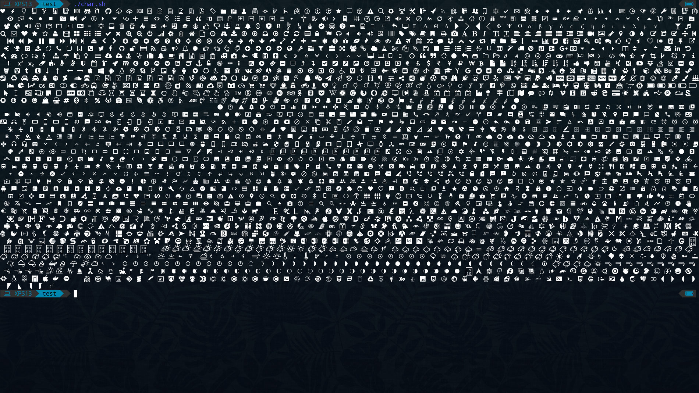
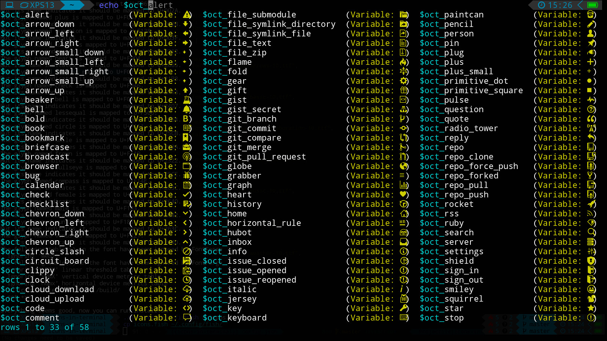

## Overview

- `icons-in-terminal` allows you to get any fonts in your terminal without replacing or patching your font.  
- You can add as many fonts as you want easily, you just need the ttf/odf file and add it to `config.json`.  
- `icons-in-terminal` can also be use with graphical applications.  

## Table of Contents

1. [**Installation**](#installation)  
2. [**Building**](#building)  
3. [**How it works**](#how-it-works)  
4. [**Included icons**](#included-icons)  
5. [**Screenshots**](#screenshots)  
6. [**Integrations**](#integrations)  
    * [**fish-shell**](#fish-integration)  
    * [**bash**](#bash-integration)  
    * [**emacs**](#emacs-integration)  
7. [**Projects using icons-in-terminal**](#projects-using-icons-in-terminal)  
    * [**ls**](#ls)  
    * [**emacs**](#emacs)  
8. [**Todos**](#todos)  

## Installation

```bash
$ git clone https://github.com/sebastiencs/icons-in-terminal.git
```

To install `icons-in-terminal`, run:  
```bash
$ ./install.sh  
$ # Follow the instructions to edit ~/.config/fontconfig/conf.d/30-icons.conf
```
Or if your terminal is [supported](https://github.com/sebastiencs/icons-in-terminal/issues/1) (Experimental)
```bash
$ ./install-autodetect.sh 
```
Done ! You can start a new terminal and run `print_icons.sh` to see the installed gryphs.  
You can see names of each icon by giving any parameter to `print_icons.sh`:  
```bash
$ ./print_icons.sh
$ ./print_icons.sh --names
$ ./print_icons.sh --names | grep ANY_NAME
```
To use icons in your terminal, **do not copy-paste icons** from the output of `print_icons.sh` but use their variable name: see [integrations](#integrations).  
When one of the provided font will be updated and add new icons, some codepoints in `icons-in-terminal.ttf` will be changed, the variable names won't.  

## Building

If you want to add new font, follow these instructions:  

There are a few dependencies to install:  

- Python 3
- [fontforge (with python extension)](https://fontforge.github.io)

You can add the name and path of your font to the file `config.json`.  
Each font can take parameters:  
- `start-from`: exclude all glyphes before the given codepoint.
- `until`: exclude all glyphes at the given codepoint and after.
- `excludes`: exclude the given codepoints.
- `move-vertically`: Use this parameter if your font and its glyphes are not centered vertically.
- `short-name`: Prefix to insert before the glyph name when you want to use the icon in your shell or anywhere else
- `map-names`: Define a name to the glyph. If not provided, the name will be read from the ttf file

Once done, you can run:  
```bash
$ ./build.sh
```
## How it works

This project is inspired by [awesome-terminal-fonts](https://github.com/gabrielelana/awesome-terminal-fonts) but is different.  
I don't modify any existing font, I merge all glyphes from the provided fonts in a new font file and insert them in the [private use areas](https://en.wikipedia.org/wiki/Private_Use_Areas).  
The file `~/.config/fontconfig/conf.d/30-icons.conf` tells to freetype to search the glyph in `icons-in-terminal.ttf` if it fails in your default font file. As the codepoints generated are in the private use areas, freetype should always fail and fallback to icons-in-terminal.ttf  
The only requirement is that your default font shouldn't be already patched/modified. But why use a patched font with a limited number of glyphes when they are all included here :)  
Your terminal emulator should also support [fallback font](https://en.wikipedia.org/wiki/Fallback_font) (most of them support it)  

## Included icons

There are already 3618 glyphes included:  

| Name                                                                             | Version        | Notes |
| ---------------------------------------------------------------------------------|---------------:|--------|
| [powerline-extra-symbols](https://github.com/ryanoasis/powerline-extra-symbols)  | commit 4eae6e8 | |
| [octicons](https://octicons.github.com/)                                         | 4.4.0          | |
| [fontawesome](http://fontawesome.io/)                                            | 4.7            | |
| [material-design-icons](https://github.com/google/material-design-icons)         | 3.0.1          | |
| [file-icons](https://atom.io/packages/file-icons)                                | 2.1.4          | |
| [weather-icons](https://erikflowers.github.io/weather-icons/)                    | 2.0.10         | |
| [font-linux](https://github.com/Lukas-W/font-linux)                              | 0.9            | |
| [devicons](https://github.com/vorillaz/devicons)                                 | 1.8.0          | |
| [Pomicons](https://github.com/gabrielelana/pomicons)                             | commit bb0a579 | |
| [linea](http://linea.io/)                                                        | 1.0            | |
| [font-mfizz](https://github.com/fizzed/font-mfizz)                               | 2.4.1          | |
| [FiraCode](https://github.com/tonsky/FiraCode)                                   | [1.200](https://github.com/tonsky/FiraCode/issues/211#issuecomment-239058632) | See if your terminal is [compatible](https://github.com/tonsky/FiraCode#terminal-support) |

## Screenshots




## Integrations

### Fish integration

To use `icons-in-terminal` with fish, add this line to `~/.config/fish/config.fish`:  
```bash
source ~/.local/share/icons-in-terminal/icons.fish
```
Restart a terminal, now you can print any icons with its name:  
```bash
$ echo $oct_location
```

### Bash integration

Add this line to your .bashrc:  
```bash
source ~/.local/share/icons-in-terminal/icons_bash.sh
```
Restart a terminal, now you can print any icons with its name:  
```bash
$ echo -e $oct_location # note the '-e'
```

### Emacs integration

Add this line to your emacs init file:
```el
(add-to-list 'load-path "~/.local/share/icons-in-terminal/")
```
To use icons-in-terminal in your package:
```el
(require 'icons-in-terminal)
(insert (icons-in-terminal 'oct_flame)) ; C-h f icons-in-terminal[RET] for more info
```

## Projects using icons-in-terminal

### ls

https://github.com/sebastiencs/ls-icons

### emacs

https://github.com/sebastiencs/sidebar.el

## Todos

- Integrate with differents shells
